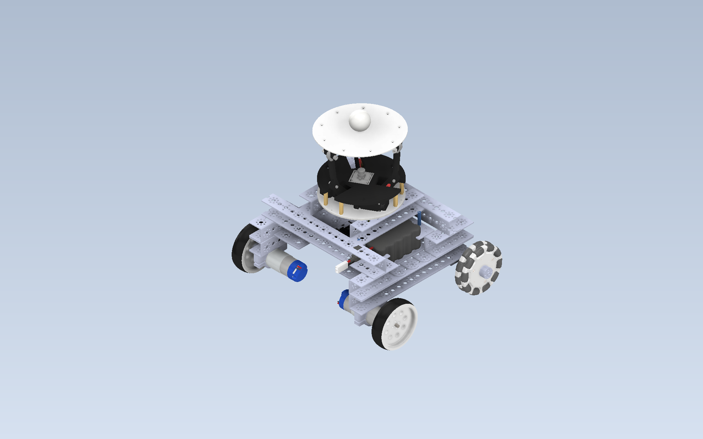

# Vision-Based Ball Balancing Using a 3-RRS Parallel Mechanism
## Mounted on a Differential-Drive Mobile Robot

  

This repository contains the mechanical design, manufacturing files,
software, electronic documentation, and supporting material developed
for the project:
